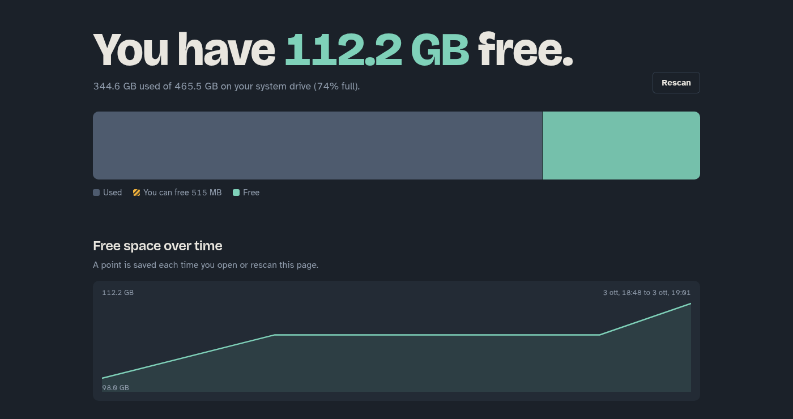

# Swiffer

Local dashboard for disk space: free space, what takes the most room, and one-click cleanup.

    python3 server.py

It opens http://localhost:8765 in your browser. Only Python's standard library is needed.

Actions that need root (pacman cache, crash dumps, logs, orphans, snapshots) go through `pkexec`,
so you get the normal password prompt. The server only listens on localhost.

`history.json` (git-ignored) stores one free-space reading per visit for the chart.
